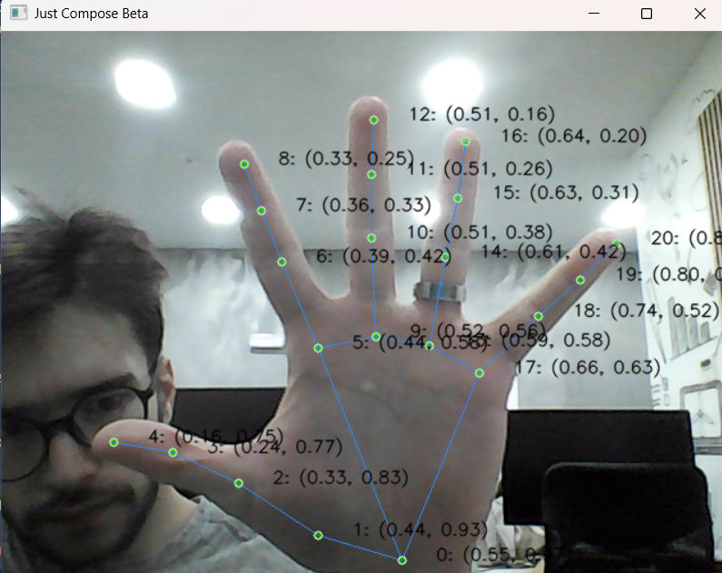
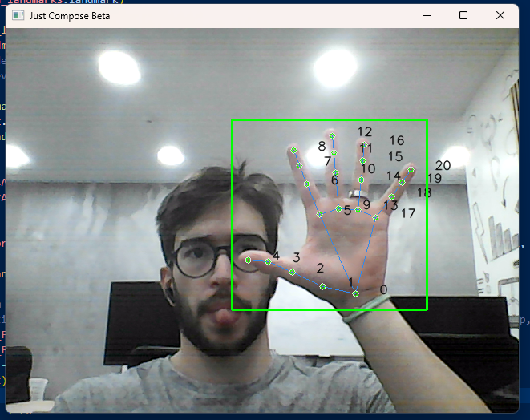

# 🎵 JustCompose Work in Progress

**Total invested time:** `5h40m`

## 🚀 Overview

**JustCompose** uses **OpenCV** to capture video/images and **MediaPipe Hands** to recognize hands in real time.
From these detections, the system interprets gestures, distances, angles, and movements to create musical interactions.


## 📸 How OpenCV Works

OpenCV captures the video stream **frame by frame**.
Each frame is sent to MediaPipe’s hand detection model for processing.

### 🗺️ Normalized Coordinates

MediaPipe uses **normalized coordinates**, meaning:

* `(0.0, 0.0)` → top-left corner
* `(1.0, 1.0)` → bottom-right corner
* Values between 0 and 1 represent proportions of the image

Example:

* Object A at `(0.50, 0.80)`
* Object B at `(0.40, 0.10)`

➡️ This means **A is to the right and below B**.



## ✋ How MediaPipe Hands Works

After calling:

```python
results = mp.solutions.hands.Hands.process(frame)
```

The `results` object contains several important attributes related to the detected hands.

Below are the attributes used by **JustCompose**:

## 🗺️ `multi_hand_landmarks` Hand Landmark Coordinates

This is the **most important** attribute. It contains 21 3D normalized landmarks for each detected hand.

| Attribute              | Type                 | Description                                                                                                       | Role in JustCompose                                                                                                 |
| ---------------------- | -------------------- | ----------------------------------------------------------------------------------------------------------------- | ------------------------------------------------------------------------------------------------------------------- |
| `multi_hand_landmarks` | `List[LandmarkList]` | A list containing 0, 1, or 2 detected hands. Each hand has 21 landmarks. Returns `None` if no hands are detected. | **Main coordinate source** → used to calculate distances, angles, gestures, finger extension, pinch detection, etc. |

### 🔸 Accessing a Landmark (Index Fingertip Point 8)

Example for the Index Finger Tip of the Right Hand:

```python
multi_hand_landmarks[0].landmark[8]:
landmark {
    x: 0.30
    y: 0.50
    z: 0.22
}
```

You may read this as:
0 → first detected hand (commonly the right hand)
8 → index fingertip landmark
Coordinates are normalized (0.0–1.0) and z represents relative depth.


## 🫲 `multi_handedness` Left or Right Hand Classification

This attribute provides the classification (“Left” or “Right”) for every detected hand.
It **matches the order** of `multi_hand_landmarks`.

| Attribute          | Type                       | Description                                      | Role in JustCompose                                                                           |
| ------------------ | -------------------------- | ------------------------------------------------ | --------------------------------------------------------------------------------------------- |
| `multi_handedness` | `List[ClassificationList]` | Classification for each hand: “Left” or “Right”. | **Role assignment** → e.g., left hand controls instruments/volume, right hand performs notes. |

### 🔸 Accessing the Hand Label

```python
for hand_landmarks, handedness in zip(
    results.multi_hand_landmarks,
    results.multi_handedness
):
    label = handedness.classification[0].label  # "Left" or "Right"
    
    if label == "Left":
        # Instrument/volume control
        pass
    else:
        # Note/sound triggering
        pass
```

## 🌍 `multi_hand_world_landmarks` Real-World 3D Coordinates

This attribute provides **true 3D coordinates (in meters)** relative to the wrist, independent of camera perspective.

| Attribute                    | Type                 | Description                                                                               | Role in JustCompose                                                                                               |
| ---------------------------- | -------------------- | ----------------------------------------------------------------------------------------- | ----------------------------------------------------------------------------------------------------------------- |
| `multi_hand_world_landmarks` | `List[LandmarkList]` | Landmarks in realistic 3D space, unaffected by image scaling or distance from the camera. | **Scale-invariant gestures** → useful for advanced control where hand size or distance must not affect detection. |

-----

## Milestones

### 🎯 Draw Landmarks

The `draw_landmarks` step is responsible for rendering the detected hands on the frame using MediaPipe’s landmarks:

- Iterates over each detected hand and its corresponding handedness (`Left` / `Right`).
- Colors are used to visually distinguish hands:
  - **Right hand** → `RGB(235, 137, 52)`
  - **Left hand** → `RGB(235, 52, 113)`
- A **confidence-based color** is also computed for the landmarks (`score_color`), transitioning from yellow to green depending on the detection score.
- Uses `mp_drawing.draw_landmarks(...)` to draw:
  - the 21 hand landmarks,
  - the connections between them,
  - custom styles for points and lines.

On top of that, `draw_landmarks` also calls:

- `draw_landmark_names(...)` → optionally draws the landmark index or coordinates next to each point, depending on the current `capture_mode` (useful for debugging and gesture design).
- `draw_bounding_box(...)` → draws a bounding box around the hand based on key landmarks.


This milestone provides a **clear visual representation of the hand pose**, making it easier to reason about gestures and interactions.

### 🟩 Draw Bounding Boxes

The `draw_bounding_box` step computes and draws a rough bounding box around the detected hand:

- Converts the normalized landmark coordinates (from MediaPipe) into pixel coordinates using the current frame size.
- Uses the most left, right, top and bottom landmarks as reference points:
- Builds a rectangle from these landmarks and adds a small padding (`± 20px`) to avoid a tight crop.
- Draws the final box with `cv.rectangle(...)` in green.

This milestone is the basis for:

- **Region-of-interest processing**
- **Gesture-based UI elements**
- Future features like cropping the hand area, tracking, or triggering effects when the hand enters a certain region.



---

## Database

The databse is based on two tables, gestures and theirs conditions
a gesture has an id, name, description and sound_file
'name': 'Number One',
'description': 'Index finger pointing up gesture',
'sound': './assets/boing.mp3',

and a gesture-condition has an id, gesture_id, landmark_a, landmark_b, operator, axis and hand_side
gesture_id: 1, 'a': 8, 'op': '<', 'b': 6, 'axis': 'y', 'side': 'any'
gesture_id: 1, 'a': 7, 'op': '<', 'b': 6, 'axis': 'y', 'side': 'any'
gesture_id: 1, 'a': 6, 'op': '<', 'b': 5, 'axis': 'y', 'side': 'any'
gesture_id: 1, 'a': 4, 'op': '>', 'b': 6, 'axis': 'y', 'side': 'any'
gesture_id: 1, 'a': 12, 'op': '>', 'b': 9, 'axis': 'y', 'side': 'any'
gesture_id: 1, 'a': 16, 'op': '>', 'b': 13, 'axis': 'y', 'side': 'any'
gesture_id: 1, 'a': 20, 'op': '>', 'b': 17, 'axis': 'y', 'side': 'any'
gesture_id: 1, 'a': 4, 'op': '>', 'b': 6, 'axis': 'x', 'side': 'right'
gesture_id: 1, 'a': 4, 'op': '<', 'b': 6, 'axis': 'x', 'side': 'left'

then, when connected the structure must be this one:
{
  1: {
    'name': 'Number One',
    'description': 'Index finger pointing up gesture',
    'sound': './assets/boing.mp3',
    'conditions': [
        {'a': 8, 'op': '<', 'b': 6, 'axis': 'y', 'side': 'any'},
        {'a': 7, 'op': '<', 'b': 6, 'axis': 'y', 'side': 'any'},
        {'a': 6, 'op': '<', 'b': 5, 'axis': 'y', 'side': 'any'},
        {'a': 4, 'op': '>', 'b': 6, 'axis': 'y', 'side': 'any'},
        {'a': 12, 'op': '>', 'b': 9, 'axis': 'y', 'side': 'any'},
        {'a': 16, 'op': '>', 'b': 13, 'axis': 'y', 'side': 'any'},
        {'a': 20, 'op': '>', 'b': 17, 'axis': 'y', 'side': 'any'},
        {'a': 4, 'op': '>', 'b': 6, 'axis': 'x', 'side': 'right'},
        {'a': 4, 'op': '<', 'b': 6, 'axis': 'x', 'side': 'left'}
    ]
  }
}
