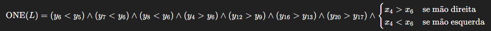
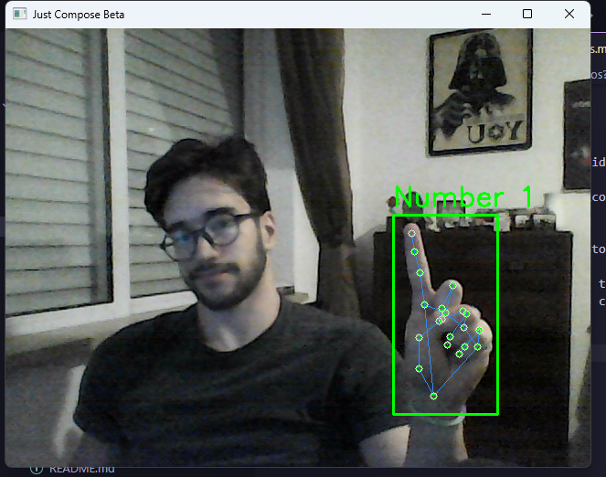
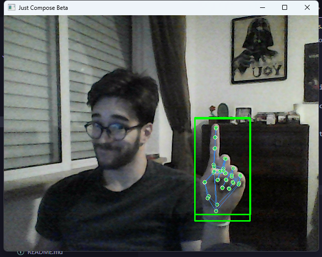
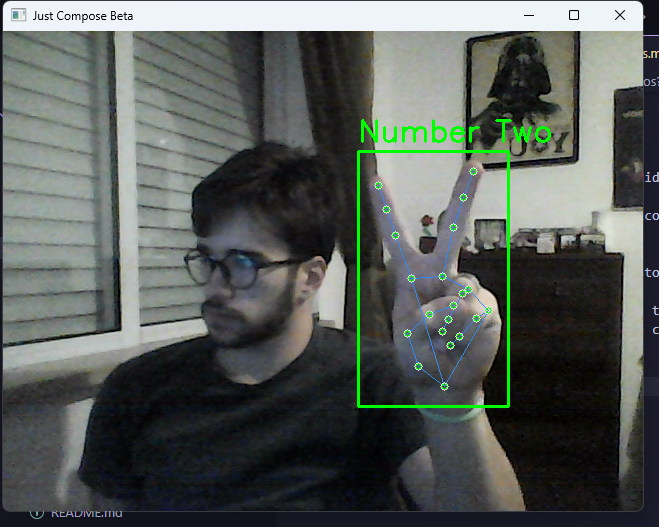
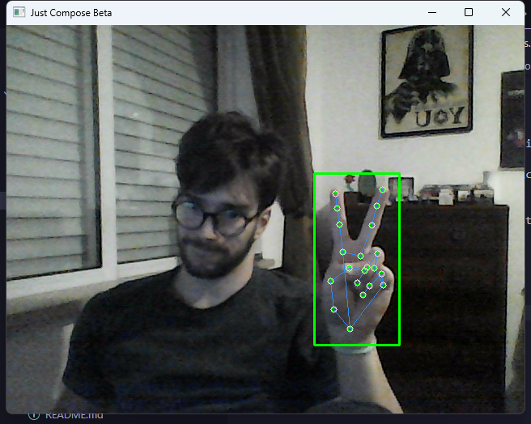
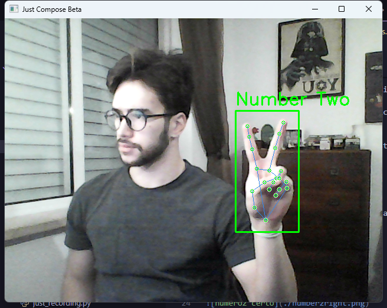
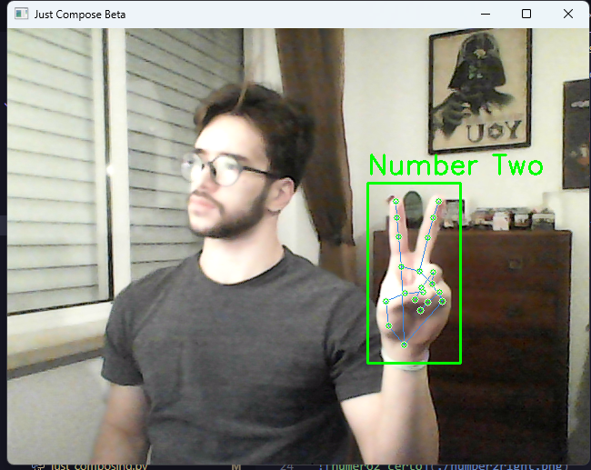
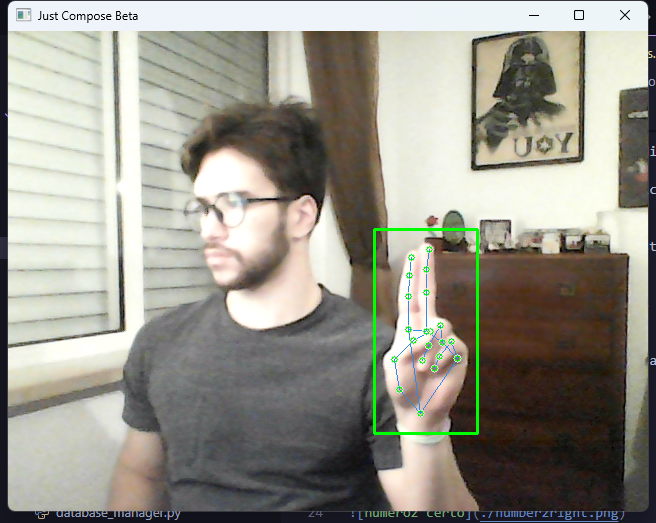

## como eu vou poder definir gestos?

### Duas abordagens: 
- Dedos Ligados
Verifico cada dedo, se estiverem extendidos os dedos determinantes de um gesto e os outros fechados, pimba, tenho um gesto
Prós: Simples e rápiod de configuras
Contras: Gestos mais simples são os únicos  possíveis, basicamente baseado em 1/0 

- Funções booleanas
Monto fórmulas para cada gesto, pois isto é um plano cartesiano, onde y5 precisa ser maior que y7, assim determino um gesto

Prós: Permite uma infinidade de gestos, tipo, 2 elevado a 42
Contra: Bah preciso fazer muuuuuuuuitos cálculos kkkkkk

### Problemas das funcões booleanas:
Overfitting de inequações, um cond falsa e já era, olha só isso

 

VS 

 

 

VS 

 

Vou tentar aplicar um score de confiança aos moves, e uma margem de erro

--- 

Tolerancia Adicionada:
 VS  VS  (ainda bem que nao foikkkkkk)

Gostei da tolerância, vou aplicar mas preciso mudar as condições mapeadas ainda

----

### Mudandos as gestures conditions para ter delta

    id           INTEGER PRIMARY KEY AUTOINCREMENT,
    gesture_id   INTEGER NOT NULL,
    type         TEXT NOT NULL DEFAULT 'bin',   -- 'bin' | 'delta' 
    landmark_a   INTEGER NOT NULL,
    operator     TEXT NOT NULL,                 -- '<', '>', '<=', '>='
    landmark_b   INTEGER,                       
    axis         TEXT,                          -- 'x', 'y'
    hand_side    TEXT NOT NULL DEFAULT 'any',   -- 'left', 'right', 'any'
    threshold    REAL,                          -- used for delta
    normalize_by TEXT,                          -- 'none', 'hand_width', 'hand_height', etc
    weight       REAL NOT NULL DEFAULT 1.0,     -- allow some rules to matter more

```python
{
    "type": "delta",
    "a": 8,          # fingertip
    "b": 6,          # pip
    "axis": "y",
    "op": "<",       # (a - b) < threshold
    "threshold": -0.10,
    "side": "any"
}
```

| Conceito                  | DELTA                                     | DISTÂNCIA                               |
| ------------------------- | ----------------------------------------- | --------------------------------------- |
| Mede direção?             | ✔ Sim                                     | ❌ Não                                   |
| Mede magnitude real?      | ❌ Pouco (só eixo isolado)                 | ✔ Sim                                   |
| Rotação da mão atrapalha? | ✔ Sim                                     | ✔ Menos                                 |
| Perfeito para reconhecer: | "finger up", "thumb inside", "left/right" | "pinch", "V shape", "open hand", "fist" |
| Sensível a ruído?         | Médias                                    | Baixo                   |

```python
database_manager.create_gesture_condition(
    gesture_id,
    type="distance",
    a=4, b=8,
    op="<",
    threshold=0.05,
    normalize_by="hand_width",
    weight=3.0   # mais importante
)
```

