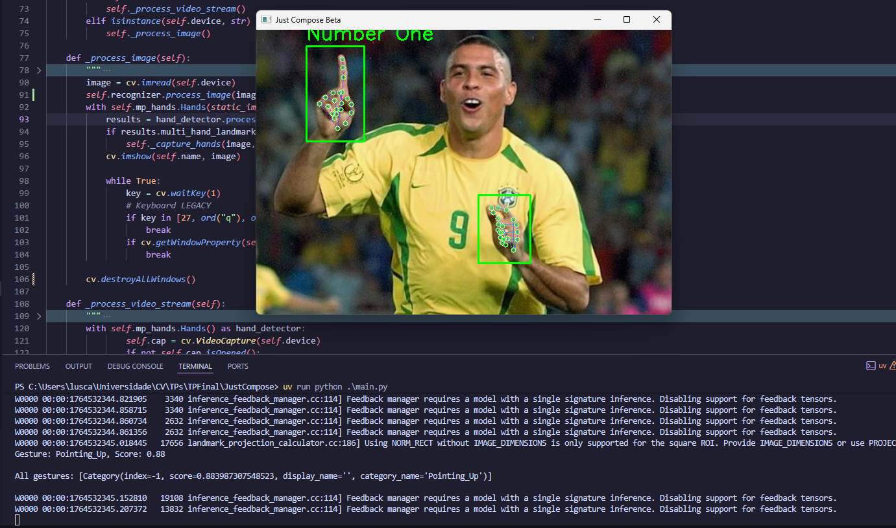
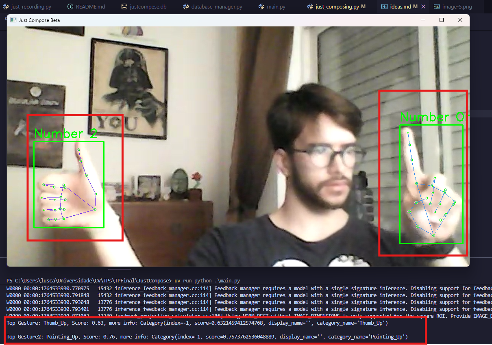

## como eu vou poder definir gestos?

Mediapipe reconhece-os nativamente

## Mas como ele funciona?

Criei uma classe para reconhecer gestos via Mediapipe, protótipo

```python
class HandSpeller():
    """
    The Gesture Recognizer
    """
    _MODEL_PATH = "C:/Users/lusca/Universidade/CV/TPs/TPFinal/JustCompose/gesture_recognizer.task"
    
    def __init__(self, model = _MODEL_PATH, running_mode=vision.RunningMode.LIVE_STREAM):
        # São atributos padrões do Mediapipe, entao declaro-os como attr
        self.base_options = python.BaseOptions(model_asset_path=model)
        self.options = vision.GestureRecognizerOptions(base_options=self.base_options, running_mode=running_mode)
        self.recognizer = vision.GestureRecognizer.create_from_options(self.options)
    
    def process_image(self, image):
        # Vou pegar um frame do OpenCV, convertê-lo para RGB e processá-lo MediaPipe 
        image_rgb = cv.cvtColor(image, cv.COLOR_BGR2RGB) # Convert BGR (OpenCV) -> RGB (MediaPipe Image)
        mp_image = mp.Image(image_format=mp.ImageFormat.SRGB, data=image_rgb)
        
        # Get the gestures
        # Mesma lógica das landmarks
        result = self.recognizer.recognize(mp_image)
        
        if not result.gestures or not result.hand_landmarks:
            return image, None, None
        
        
        top_gesture = result.gestures[0][0]  # [hand][ranking]
        gesture_name = top_gesture.category_name
        gesture_score = top_gesture.score
        # Exemplo: All gestures: [Category(index=-1, score=0.883987307548523, display_name='', category_name='Pointing_Up')] 

        print(f"Gesture: {gesture_name}, Score: {gesture_score:.2f}\n")
        for i in range(len(result.gestures)):
            print(f"All gestures: {result.gestures[i]}\n")
```
Saída esperada (detalhe ao console):




## Print do GestureRecognizerResult

o HandSpeller retorna uma lista com as mãos, que são o seguinte objeto: 
```python
GestureRecognizerResult(
    # É uma lista de listas para suportar múltiplas mãos com múltiplos gestos.
    gestures=[
        [
            Category(
                index=-1, 
                score=0.6321459412574768, 
                display_name='', 
                category_name='Thumb_Up'  # <- O nome do gesto reconhecido
            )
        ]
    ],
    
    # Lista de classificações de 'handedness' (Mão Direita/Esquerda)
    handedness=[
        [
            Category(
                index=0, 
                score=0.7721295356750488, 
                display_name='Right', 
                category_name='Right'  # <- Classificação da mão (Direita)
            )
        ]
    ],
    
    # Landmarks da mão em coordenadas normalizadas (0.0 a 1.0)
    # Lista de listas, onde a lista interna representa uma mão detectada.
    hand_landmarks=[
        [
            # Landmark 0 (Pulso - Root)
            NormalizedLandmark(x=0.1922, y=0.7747, z=-6.52e-08, visibility=0.0, presence=0.0), 
            
            # Landmarks do DEDÃO (Thumb: 1, 2, 3, 4)
            NormalizedLandmark(x=0.1906, y=0.7037, z=-0.0146, visibility=0.0, presence=0.0),
            NormalizedLandmark(x=0.1708, y=0.6097, z=-0.0229, visibility=0.0, presence=0.0),
            NormalizedLandmark(x=0.1589, y=0.5426, z=-0.0296, visibility=0.0, presence=0.0),
            NormalizedLandmark(x=0.1540, y=0.4900, z=-0.0347, visibility=0.0, presence=0.0),
            
            # Landmarks dos OUTROS DEDOS (Index: 5-8, Middle: 9-12, Ring: 13-16, Pinky: 17-20)
            NormalizedLandmark(x=0.1277, y=0.6540, z=-0.0233, visibility=0.0, presence=0.0), # 5 - Base do Indicador
            NormalizedLandmark(x=0.0830, y=0.6506, z=-0.0420, visibility=0.0, presence=0.0), # 6
            NormalizedLandmark(x=0.1060, y=0.6654, z=-0.0508, visibility=0.0, presence=0.0), # 7
            NormalizedLandmark(x=0.1255, y=0.6682, z=-0.0543, visibility=0.0, presence=0.0), # 8 - Ponta do Indicador
            # ... (e assim por diante para os 21 landmarks)
            NormalizedLandmark(x=0.1221, y=0.7031, z=-0.0242, visibility=0.0, presence=0.0), # 9 - Base do Dedo Médio
            NormalizedLandmark(x=0.0784, y=0.7058, z=-0.0397, visibility=0.0, presence=0.0), # 10
            NormalizedLandmark(x=0.1039, y=0.7144, z=-0.0415, visibility=0.0, presence=0.0), # 11
            NormalizedLandmark(x=0.1230, y=0.7163, z=-0.0415, visibility=0.0, presence=0.0), # 12 - Ponta do Dedo Médio
            NormalizedLandmark(x=0.1235, y=0.7530, z=-0.0274, visibility=0.0, presence=0.0), # 13 - Base do Dedo Anelar
            NormalizedLandmark(x=0.0845, y=0.7548, z=-0.0425, visibility=0.0, presence=0.0), # 14
            NormalizedLandmark(x=0.1054, y=0.7572, z=-0.0368, visibility=0.0, presence=0.0), # 15
            NormalizedLandmark(x=0.1236, y=0.7575, z=-0.0310, visibility=0.0, presence=0.0), # 16 - Ponta do Dedo Anelar
            NormalizedLandmark(x=0.1290, y=0.7992, z=-0.0318, visibility=0.0, presence=0.0), # 17 - Base do Dedo Mínimo
            NormalizedLandmark(x=0.0951, y=0.8009, z=-0.0416, visibility=0.0, presence=0.0), # 18
            NormalizedLandmark(x=0.1090, y=0.7995, z=-0.0364, visibility=0.0, presence=0.0), # 19
            NormalizedLandmark(x=0.1244, y=0.7999, z=-0.0310, visibility=0.0, presence=0.0)  # 20 - Ponta do Dedo Mínimo
        ]
    ],
    
    # Landmarks da mão em coordenadas de mundo (metros)
    # Estas coordenadas são 3D e dão a posição real da mão no espaço.
    hand_world_landmarks=[
        [
            # Landmark 0 (Pulso) - Note que os valores Z são muito maiores aqui (profundidade).
            Landmark(x=0.0549, y=0.0365, z=0.0555, visibility=0.0, presence=0.0),
            
            # Landmark 1 (Dedo Polegar)
            Landmark(x=0.0454, y=-0.0008, z=0.0332, visibility=0.0, presence=0.0),
            # ... (os 21 landmarks de mundo seguem a mesma ordem de NormalizedLandmark)
            Landmark(x=-0.0037, y=0.0354, z=0.0011, visibility=0.0, presence=0.0) # 20 - Ponta do Dedo Mínimo
        ]
    ]
)
```

Exemplo com dois gestos:


```python
GestureRecognizerResult(
    # ==========================================================
    # GESTOS DETECTADOS (Gestures)
    # Lista de gestos, onde o primeiro elemento é a Mão 1 e o segundo é a Mão 2.
    # ==========================================================
    gestures=[
        [
            # Mão 1: Polegar para Cima (Thumb_Up)
            Category(
                index=-1, 
                score=0.632, 
                display_name='', 
                category_name='Thumb_Up'
            )
        ],
        [
            # Mão 2: Apontando para Cima (Pointing_Up)
            Category(
                index=-1, 
                score=0.757, 
                display_name='', 
                category_name='Pointing_Up'
            )
        ]
    ],
    
    # ==========================================================
    # CLASSIFICAÇÃO DA MÃO (Handedness)
    # A ordem corresponde à ordem dos gestos e landmarks.
    # ==========================================================
    handedness=[
        [
            # Mão 1: Classificada como Mão Direita
            Category(
                index=0, 
                score=0.772, 
                display_name='Right', 
                category_name='Right'
            )
        ],
        [
            # Mão 2: Classificada como Mão Esquerda
            Category(
                index=1, 
                score=0.995,  # Alta confiança na classificação da mão
                display_name='Left', 
                category_name='Left'
            )
        ]
    ],
    
    # ==========================================================
    # LANDMARKS DA MÃO (Coordenadas Normalizadas 0.0-1.0)
    # Contém duas listas de 21 Landmarks cada (uma para cada mão).
    # ==========================================================
    hand_landmarks=[
        # ------------------------------------------------------
        # HAND_LANDMARKS[0]: Mão Direita (Thumb_Up)
        # ------------------------------------------------------
        [
            NormalizedLandmark(x=0.1922, y=0.7747, z=-6.52e-08, ...), # 0 - Pulso
            NormalizedLandmark(x=0.1906, y=0.7037, z=-0.0146, ...),  # 1 - Dedo 1 (Polegar)
            # ... mais 19 landmarks da Mão Direita (omiti o resto para brevidade)
            NormalizedLandmark(x=0.1244, y=0.7999, z=-0.0310, ...) # 20 - Ponta do Dedo 5 (Mínimo)
        ], 
        # ------------------------------------------------------
        # HAND_LANDMARKS[1]: Mão Esquerda (Pointing_Up)
        # ------------------------------------------------------
        [
            NormalizedLandmark(x=0.9066, y=0.8752, z=-1.85e-07, ...), # 0 - Pulso
            NormalizedLandmark(x=0.8796, y=0.8213, z=-0.0205, ...),  # 1 - Dedo 1 (Polegar)
            # ... mais 19 landmarks da Mão Esquerda
            NormalizedLandmark(x=0.9354, y=0.8300, z=-0.0299, ...) # 20 - Ponta do Dedo 5 (Mínimo)
        ]
    ],
    
    # ==========================================================
    # LANDMARKS DE MUNDO (Coordenadas em Metros)
    # Contém duas listas de 21 Landmarks 3D.
    # ==========================================================
    hand_world_landmarks=[
        # ------------------------------------------------------
        # HAND_WORLD_LANDMARKS[0]: Mão Direita
        # ------------------------------------------------------
        [
            Landmark(x=0.0549, y=0.0365, z=0.0555, ...), # 0 - Pulso (em metros)
            # ... (20 landmarks restantes da Mão Direita)
            Landmark(x=-0.0037, y=0.0354, z=0.0011, ...)
        ], 
        # ------------------------------------------------------
        # HAND_WORLD_LANDMARKS[1]: Mão Esquerda
        # ------------------------------------------------------
        [
            Landmark(x=-0.0131, y=0.0641, z=0.0693, ...), # 0 - Pulso (em metros)
            # ... (20 landmarks restantes da Mão Esquerda)
            Landmark(x=0.0011, y=0.0487, z=0.0031, ...)
        ]
    ]
)
```

Se eu quiser saber o gesto da mão esquerda e as coordenadas do index finger da mão direita:
```python
print(GestureRecognizerResult.gestures[1][0].category_name) # Nos gestos -> Mão esquerda -> Attr do nome
print(GestureRecognizerResult.hand_landmarks[0][6:9]) # Nas landmarks normalizadas -> Mão Direita -> Landmarks do index finger -> Print de suas coords completas
```

Maniopulando mais ele
```python
pprint.pprint(f"{results.gestures}", indent=4)
# ("[[Category(index=-1, score=0.6321459412574768, display_name='', "
# "category_name='Thumb_Up')], [Category(index=-1, score=0.7573762536048889, "
# "display_name='', category_name='Pointing_Up')]]")

pprint.pprint(f"{results.gestures[0]}", indent=4) 
# ("[Category(index=-1, score=0.6321459412574768, display_name='', category_name='Thumb_Up')]")
print(type(results.gestures[0])),
# <class 'list'>
```